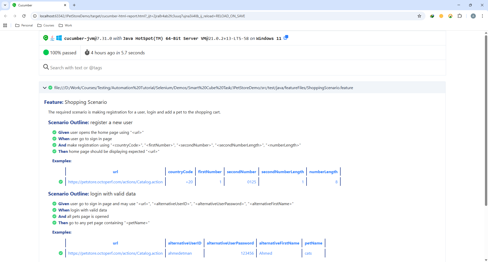
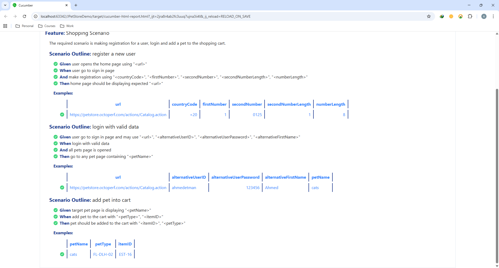
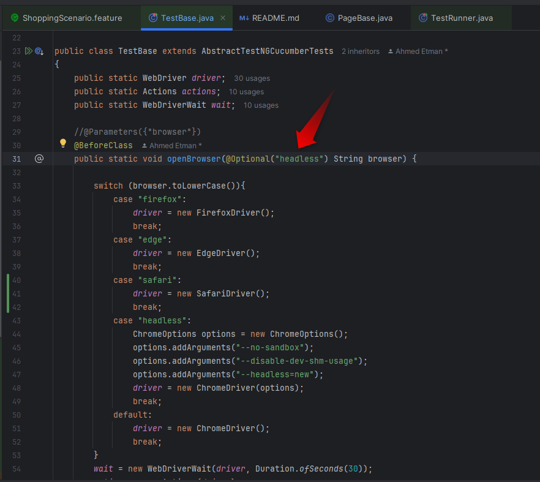

**JPetStore Automation Framework**

This repository contains an automated testing framework for the JPetStore website using:
- Java
- Selenium WebDriver
- TestNG
- Cucumber BDD (Gherkin)
- Page Object Model (POM)
- Maven
- GitHub Actions CI/CD

It Covers the following:
- User registration.
- Login with registered data or login with previously registered data (in case of registration failure).
- Browsing all available pets.
- Adding a pet to the shopping cart

The project demonstrates clean automation architecture and daily scheduled execution through GitHub Actions.

**Project Structure:**
- src
  - main
    - java
      - pages
        - AllPetsPage.java
        - HomePage.java
        - ItemDetailsPage.java
        - PageBase.java
        - PetItemsPage.java
        - PetPage.java
        - RegistrationPage.java
        - ShoppingCartPage.java
        - SignInPage.java
  - test
    - java
      - featureFiles
        - ShoppingScenario.feature
      - runner
        - TestRunner.java
      - stepDefinitions
        - PurchaseAPet.java
      - testcases
        - TestBase.java

**How to Run the Project Locally**

**1- Prerequisites**

Make sure you have the following installed:
- JDK 21
- Maven +3.8

**2- Open the project**

You can open the project with one of the following:

- IntelliJ IDEA (recommended)
- Eclipse
- VS Code (with Java extension)

**3- Install Dependencies**

Open a terminal inside the project folder and run:

_mvn clean install_

This command will:
- Download all required Maven dependencies
- Build the project
- Validate the setup

**4- Execute Tests Locally**

To run all automation tests, use:

_mvn clean test_

Or you can run the test runner manually using IntelliJ:

_src/test/java/runner/TestRunner.java_

This class is responsible for:

- Loading all Cucumber features
- Binding step definitions
- Generating the test report

**5- Cucumber HTML Report**

After executing the tests (locally or in GitHub Actions), a Cucumber HTML report is generated here:
_target/cucumber-html-report.html_

To view the report:

- Navigate to the target folder
- Open _cucumber-html-report.html_
- The browser will display a formatted report including Passed/Failed steps

**6- Running Tests Automatically via GitHub Actions**

This project contains a workflow file located at:

_.github/workflows/automation.yml_

Schedule

The workflow runs automatically every day at 01:30 AM UTC:

_cron: "30 1 * * *"_

What GitHub Actions Does

The workflow automatically:
- Checks out your repository
- Sets up JDK 21
- Caches Maven dependencies
- Runs the tests ("mvn clean test" command)
- Uploads test reports as artifacts

You can view the results in:

GitHub → Actions → Latest Workflow Run → Artifacts

**7- How the Automation Flow Works**

Here is the complete test execution flow:

1- Feature File: Defines the BDD scenario using Gherkin

2- Step Definitions: Java functions that implement the Gherkin steps

3- Page Objects: contain actions & locators

4- TestRunner: Triggers execution with TestNG + Cucumber

5- Reports Generated Automatically

## 📸 Test Report

**Notes:**

- Reports are generated automatically on every test execution
- The project follows a clean Page Object Model structure
- GitHub Actions ensures daily execution without manual intervention
- You can add more Feature files and Step Definitions and they will run automatically
- Browser is configured to be "chrome" by default, if you'd like to change it, you can make the following steps:
  - Open _"TestBase.java"_ class, you can find it at _"src/test/java/testcases"_
  - Go to the following line:
    
  - Change **"chrome"** with one of the following:
    - **"firefox"**: to run tests on firefox browser
    - **"edge"**: to run tests on edge browser
- Step definitions use dynamic variables:
  - **static String userID = "", password = "", firstName = "";**
  - If registration fails, the test falls back to alternative user credentials from the feature file.
- In case there's a failed test case, a screenshot will be taken for the page that contains the failure with latest situation before browser closure, you can find it at "Screenshots" folder in the main project path, this folder will be created automatically when test case fails 

**Conclusion**

This README fully explains how to:
- Understand the project structure
- Run the project locally
- Generate the HTML report
- Use GitHub Actions
- Extend or modify the automation

**Author**

Developed by **Ahmed Etman**

🔗 LinkedIn: https://www.linkedin.com/in/ahmedetman24/
🔗 GitHub: https://github.com/ahmedetman24
